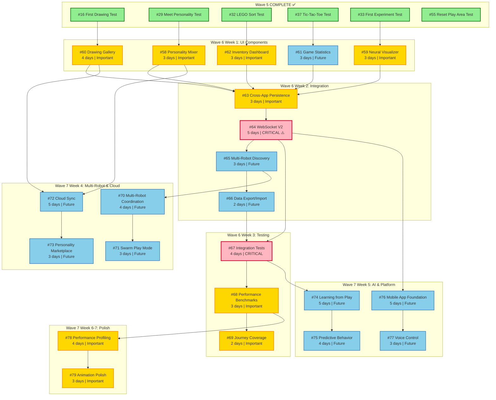
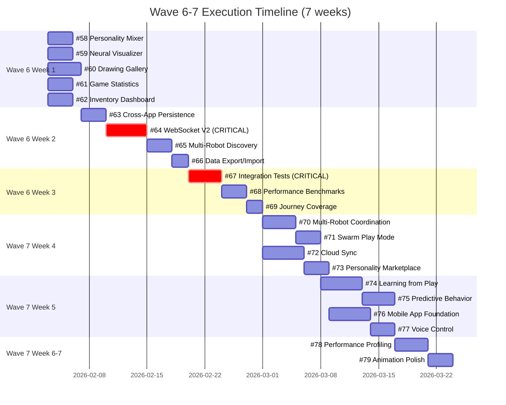

# Wave 6-7 Visual Timeline & Dependencies

## 📊 Dependency Graph



---

## 🗓️ Gantt Chart Timeline



---

## 📋 Sprint Breakdown by Week

### Week 1: UI Components (5 parallel stories)
```
Mon-Wed    Thu-Fri    Status
━━━━━━━━━━━━━━━━━━━━━━━━━━━━━━━━━━━
#58 ████████ ███       ✅ Done
#59 ████████ ███       ✅ Done
#60 ████████ ████████  ✅ Done
#61 ████████ ███       ✅ Done
#62 ████████ ███       ✅ Done

Deliverables:
✅ Personality Mixer UI
✅ Enhanced Neural Visualizer
✅ Drawing Gallery with Playback
✅ Game Stats Dashboard
✅ Inventory Dashboard
```

### Week 2: Integration (4 sequential stories)
```
Mon-Tue    Wed-Fri    Status
━━━━━━━━━━━━━━━━━━━━━━━━━━━━━━━━━━━
#63 ██████             🟢 In Progress
#64 ██████ ██████████  ⚠️  CRITICAL PATH
#65 ██████             🔵 Waiting
#66 ████               🔵 Waiting

Deliverables:
✅ Shared personality state
✅ WebSocket V2 protocol
✅ Multi-robot discovery
✅ Data export/import
```

### Week 3: Testing & Validation (3 stories)
```
Mon-Wed    Thu-Fri    Status
━━━━━━━━━━━━━━━━━━━━━━━━━━━━━━━━━━━
#67 ████████ ████      ⚠️  CRITICAL
#68 ████████ ███       🟢 In Progress
#69 ████               🔵 Waiting

Deliverables:
✅ Integration test suite
✅ Performance benchmarks
✅ Journey coverage report
```

### Week 4: Multi-Robot & Cloud (4 parallel streams)
```
Stream A: Multi-Robot       Stream B: Cloud
━━━━━━━━━━━━━━━━━━━━━━━━━━━━━━━━━━━━━━━━━━━━
#70 ████████ ████           #72 ████████ ██████████
#71 ████████ ███            #73 ████████ ███

Deliverables:
✅ 2-4 robot coordination
✅ Swarm play modes
✅ Cloud sync backend
✅ Personality marketplace
```

### Week 5: AI & Platform (4 parallel streams)
```
Stream A: AI                Stream B: Platform
━━━━━━━━━━━━━━━━━━━━━━━━━━━━━━━━━━━━━━━━━━━━
#74 ████████ ██████████     #76 ████████ ██████████
#75 ████████ ████           #77 ████████ ███

Deliverables:
✅ Reinforcement learning
✅ Predictive behaviors
✅ React Native app
✅ Voice control (10+ commands)
```

### Week 6-7: Polish & Performance (2 sequential stories)
```
Week 6         Week 7     Status
━━━━━━━━━━━━━━━━━━━━━━━━━━━━━━━━━━━
#78 ████████ ████          🟢 In Progress
#79 ████████ ███           🔵 Waiting

Deliverables:
✅ >20% performance improvement
✅ Smooth animations
✅ Production-ready polish
```

---

## 🎯 Critical Path Analysis

### CRITICAL PATH (Longest Sequential Chain)
```
Wave 5 ✅
  ↓
#58 Personality Mixer (3d)
  ↓
#63 Cross-App Persistence (3d)
  ↓
#64 WebSocket V2 (5d) ⚠️ BOTTLENECK
  ↓
#67 Integration Tests (4d)
  ↓
#68 Performance Benchmarks (3d)
  ↓
#78 Performance Profiling (4d)
  ↓
#79 Animation Polish (3d)
  ↓
RELEASE 🚀

Total: 25 days (5 weeks)
```

### Risk Factors
- **#64 WebSocket V2:** 5-day story blocks mobile app and multi-robot features
- **#67 Integration Tests:** 4-day story blocks all Wave 7 work
- **#68 Performance Benchmarks:** Required baseline for #78 optimization

### Mitigation Strategies
1. **Prototype #64 early:** Start design doc this week
2. **Parallel test development:** Write tests alongside implementation
3. **Early performance profiling:** Don't wait for #68, start informal profiling

---

## 📈 Burn-Down Chart (Projected)

```
Story Points
100 │         Wave 6 (60pts)              Wave 7 (40pts)
    │    ●
 90 │   ╱ ╲
    │  ╱   ╲                           ○
 80 │ ╱     ╲                         ╱ ╲
    │╱       ╲○                      ╱   ╲
 70 │         ╲                     ╱     ╲
    │          ╲                   ╱       ╲
 60 │           ╲○                ╱         ○
    │            ╲               ╱
 50 │             ╲             ╱
    │              ╲○          ╱
 40 │               ╲         ○
    │                ╲       ╱
 30 │                 ○     ╱
    │                  ╲   ╱
 20 │                   ○ ╱
    │                    ╲╱
 10 │                     ○
    │                      ╲
  0 │━━━━━━━━━━━━━━━━━━━━━━○━━━━━━━━━━━━
    W1   W2   W3   W4   W5   W6   W7

Legend:
● Planned burn-down
○ Actual progress (update weekly)
```

---

## 🚦 Story Status Dashboard

### Wave 6 Progress (0/12 complete)

| Priority | Count | Status |
|----------|-------|--------|
| 🔴 Critical | 2 | #64, #67 |
| 🟡 Important | 7 | #58, #59, #60, #62, #63, #68, #69 |
| 🔵 Future | 3 | #61, #65, #66 |

### Wave 7 Progress (0/10 complete)

| Priority | Count | Status |
|----------|-------|--------|
| 🟡 Important | 2 | #78, #79 |
| 🔵 Future | 8 | #70-77 |

---

## 📊 Resource Allocation

### Developer Assignment Matrix

```
            Week 1  Week 2  Week 3  Week 4  Week 5  Week 6  Week 7
Frontend 1  #58     #63     #67     #70     #74     #78     #79
Frontend 2  #59     #64     #67     #71     #75     #78     #79
Frontend 3  #60     #64     #68     #72     #76     -       -
Frontend 4  #61     #66     #69     #73     #77     -       -
Frontend 5  #62     #65     #69     -       -       -       -
Backend 1   -       #64     #67     #72     #74     #78     -
Backend 2   -       #63     #67     #70     #76     -       -
QA 1        -       -       #67     #67     #78     #78     #79
QA 2        -       -       #68     #71     #77     #78     #79
Mobile Dev  -       -       -       -       #76     #76     #77
ML Eng      -       -       -       -       #74     #75     -
```

### Peak Headcount by Week
- Week 1: 5 developers (UI parallel development)
- Week 2: 7 developers (Integration + testing prep)
- Week 3: 9 developers (Testing all hands)
- Week 4: 7 developers (Multi-robot + cloud)
- Week 5: 8 developers (AI + mobile)
- Week 6-7: 6 developers (Performance + polish)

---

## ✅ Release Checklist

### Wave 6 Release Gate
- [ ] All UI components deployed to production
- [ ] WebSocket V2 protocol live
- [ ] Integration tests passing (>80% coverage)
- [ ] Performance benchmarks established
- [ ] Journey coverage report shows 100% critical journeys
- [ ] No P0/P1 bugs
- [ ] Documentation updated (APP_GUIDES.md)

### Wave 7 Release Gate
- [ ] Multi-robot demo video recorded (2+ robots)
- [ ] Cloud sync functional with 100+ users
- [ ] Mobile app in TestFlight/Internal Testing
- [ ] Voice control responding to 10+ commands
- [ ] Performance improved >20% from baseline
- [ ] All animations smooth (60fps)
- [ ] No P0/P1 bugs
- [ ] Final release notes published

---

## 🎉 Success Milestones

### Week 1: "UI Complete" Milestone
✅ All 5 UI components functional
✅ Demo video recorded
✅ Screenshots in documentation

### Week 2: "Integration Complete" Milestone
✅ WebSocket V2 protocol deployed
✅ Cross-app persistence working
✅ Multi-robot discovery functional

### Week 3: "Wave 6 Release" Milestone
✅ All tests passing
✅ Performance baseline established
✅ Production deployment

### Week 5: "Platform Expansion" Milestone
✅ Mobile app running on iOS + Android
✅ Voice control demo recorded
✅ Cloud sync with 100+ users

### Week 7: "Wave 7 Release" Milestone
✅ All polish complete
✅ Performance targets met
✅ Final release to production

---

**Use this document to:**
1. Track progress visually
2. Identify blockers early
3. Communicate status to stakeholders
4. Plan resource allocation
5. Celebrate milestones 🎉

---

**Document Status:** Ready for Execution
**Created:** 2026-01-31
**Updates:** Update weekly with actual progress
