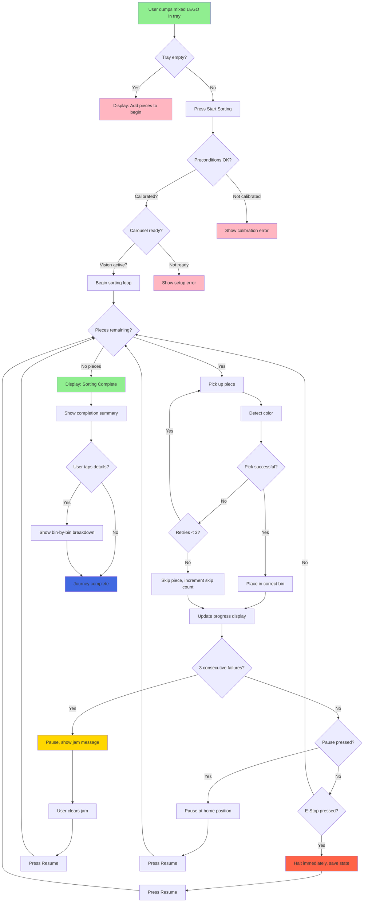
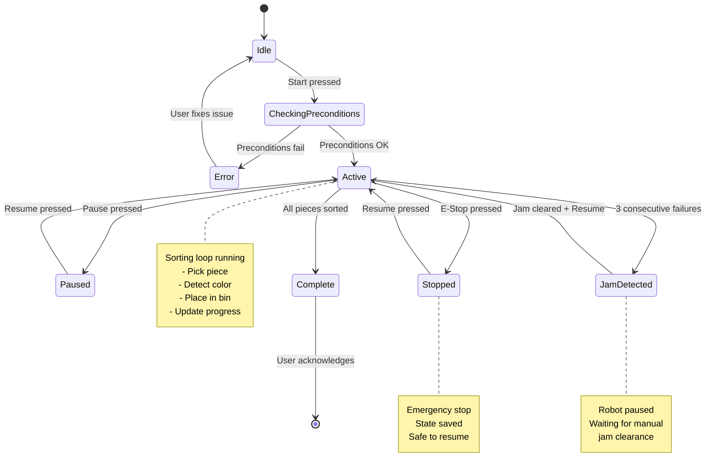
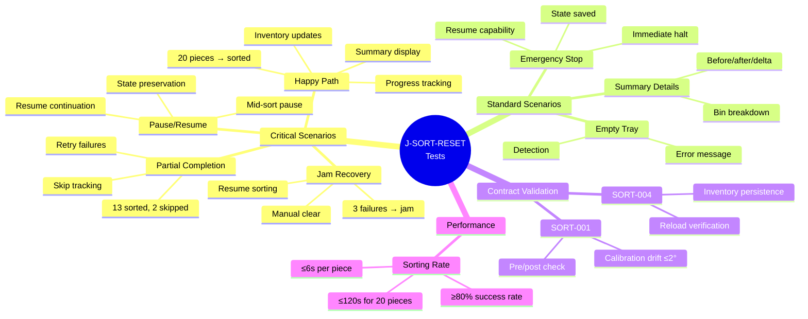
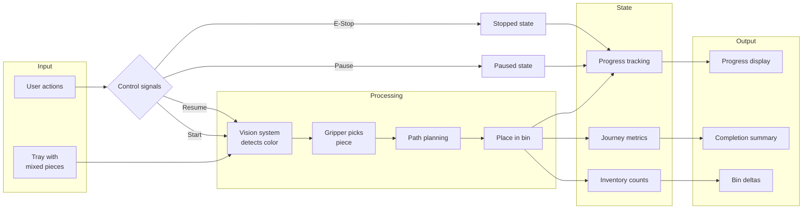
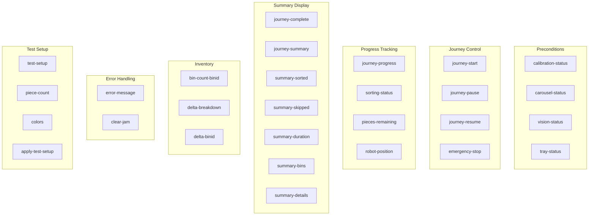
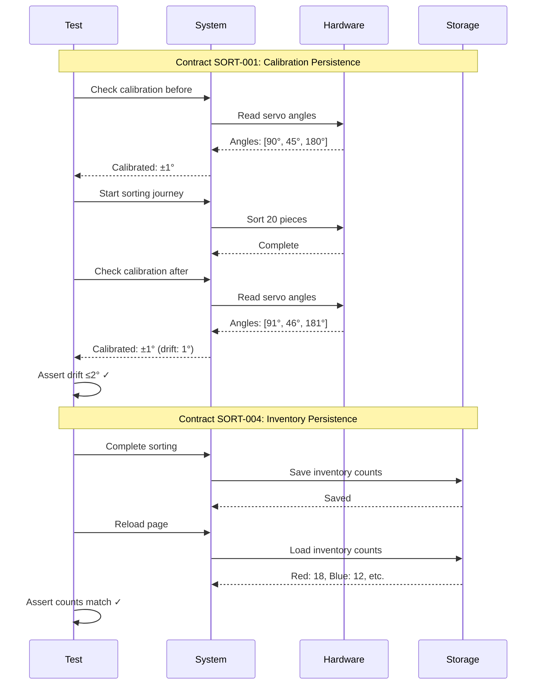
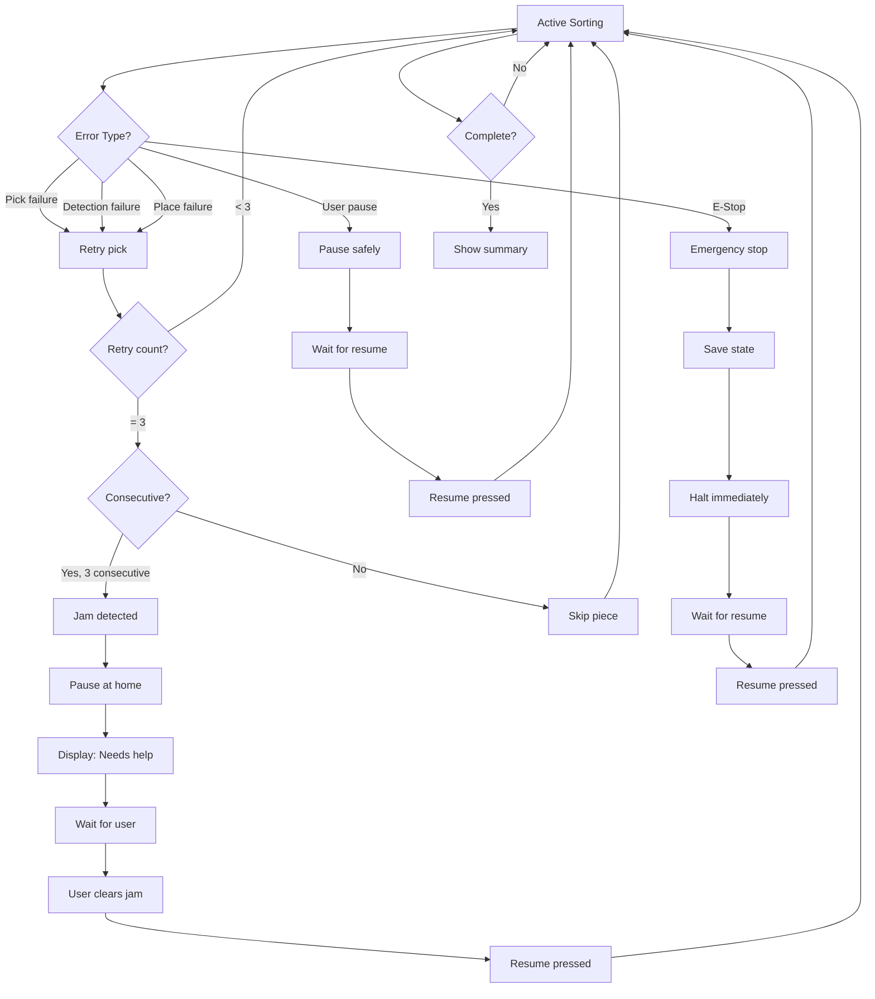

# J-SORT-RESET Journey Flow

## User Journey Flow

## State Machine

## Test Scenario Coverage Map

## Data Flow

## Test ID Mapping

## Performance Targets

| Metric | Target | Test Validation |
|--------|--------|----------------|
| **Pieces per minute** | ≥10 | Measured in performance test |
| **Time per piece** | ≤6 seconds | Avg calculated from total time |
| **Success rate** | ≥80% | Sorted / (Sorted + Skipped) |
| **Total time (20 pieces)** | ≤120 seconds | Timeout enforced |
| **Calibration drift** | ≤2° | Pre/post comparison |
| **Jam detection** | 3 consecutive failures | Simulated in test |
| **Pause latency** | Current op completes | ≤10 seconds |
| **E-Stop latency** | Immediate halt | ≤2 seconds |

## Contract Validation Points

## Error Recovery Flow

## Key Learnings

1. **Pause must be safe**: Current operation completes before pausing
2. **E-Stop is immediate**: No graceful completion, halt instantly
3. **Jam detection**: 3 consecutive failures trigger jam state
4. **State preservation**: All counters and progress saved on pause/stop
5. **Inventory persistence**: Changes written to storage, survive reload
6. **Progress visibility**: User always sees current piece count
7. **Performance target**: 6 seconds per piece max, 80% success min
8. **Contract enforcement**: Automated validation of SORT-001, SORT-004
